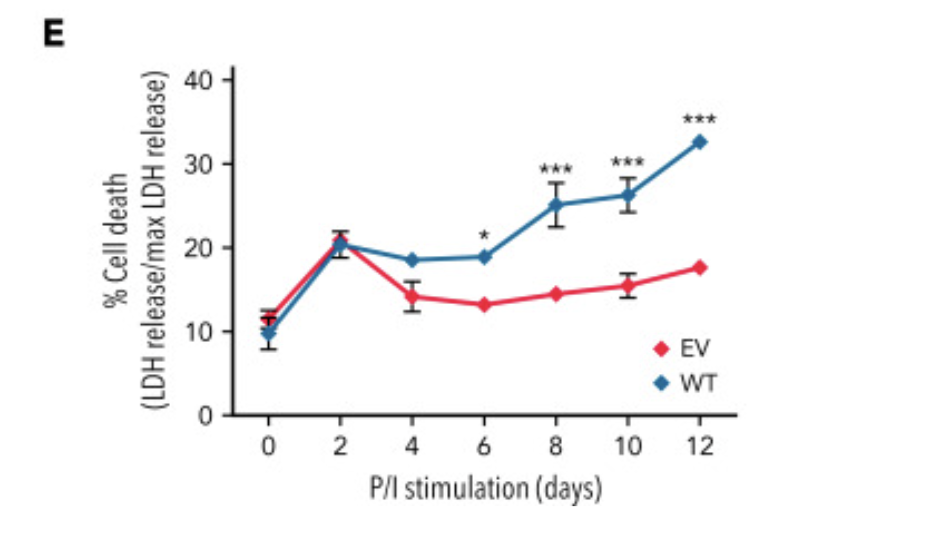

```{r, include=FALSE}
# Installing and loading packages

if (! requireNamespace("BiocManager", quietly = TRUE)) {
  install.packages("BiocManager")
}

if (! requireNamespace("GEOquery", quietly = TRUE)) {
  BiocManager::install("GEOquery")
}

if (!requireNamespace("edgeR", quietly = TRUE)) {
  install.packages("edgeR")
}

library(GEOquery)
library(edgeR)
```


### Why I chose this dataset

For my dataset, I chose the paper, [Human germline biallelic complete NFAT1 deficiency causes the triad of joint contractures, osteochondromas, and susceptibility to B cell malignancy](https://www.ncbi.nlm.nih.gov/geo/query/acc.cgi?acc=GSE193414). I chose a dataset that focuses on B-cell lymphoma as it was related to my BCB430 research. Since my research was on B-cells for B-cell lymphoma, I wanted to look at T-cells and this paper was the perfect dataset to do so. It looks at NFAT1 (nuclear factor of activated T cells 1) which mediates calcium-calcineurin signals that drive cell activation, survival, and proliferation. This paper sequences a human that has a complete deficiency of NAFT1 and analyzes the affect of this deficiency. They also sequence his parents, who have a consanguineous relationship. @sharma2022human


### Basic information of the dataset

There are 18 bulk RNA-seq samples from three patients. One patient is the first reported case of human complete NFAT1 deficiency. The other two are his parents who had a consanguineous relationship. Illumina NextSeq 500 was used for sequencing. Half of the 18 samples (labelled as "patient") are infected with an empty vector, thus is the negative control. The other 9 samples are infected with WT-NFATC2 which is the test condition.

Each replicate's patient and rescue samples were treated with PMAIonomycin and IL-1b. Thus there are 3 treatment groups, one untreated, PMAIono, and IL1b for each replicate's patient and rescue samples.

In the paper, they confirmed the functions of NFAT1 regarding cell-death, where the rescued WT-NFATC2 samples showed significantly less resistance to cell-death compared to the empty vector samples. @sharma2022human

{width=50%}

### Downloading data

The dataset's GEO accession number is GSE193414. The code below will downloads the raw counts and its metadata into a .rds format.

```{r}
# Downloading metadata
accession <- "GSE193414"
if (!file.exists(paste0(accession,".rds"))) {
  metadata <- GEOquery::getGEO(accession, GSEMatrix =TRUE, getGPL=FALSE)
  metadata <- metadata[[1]]
  saveRDS(metadata, paste0(accession, ".rds"))
} else {
  metadata <- readRDS(paste0(accession, ".rds"))
}

```

```{r}
# Download raw counts
downloadUrl <- "https://www.ncbi.nlm.nih.gov/geo/download/?acc=GSE193414&format=file"
completePath <- paste(downloadUrl, "file=GSE193414_rawcounts.txt.gz", sep="&");
if (!file.exists(paste(accession,"rawCounts.rds", sep = "_"))) {
  countMatrix <- as.matrix(data.table::fread(completePath, header=T, colClasses="integer"), rownames=1)
  saveRDS(countMatrix, paste(accession, "rawCounts.rds", sep = "_"))
} else {
  countMatrix <- readRDS(paste(accession, "rawCounts.rds", sep = "_"))
}
```
## Data Processing

### Process metadata 

The metadata has alot of information but we only need the first column which indicates the sample and its treatment group and the column that indicates the replicate number. With this, we can process the metadata to group each sample with its treatment group.

```{r}
fullMetadata <- metadata@phenoData@data
sampleMetadata <- fullMetadata[1] # extract relevant columns
sampleMetadata$Replicate <- fullMetadata$"replicate number:ch1" 

# we need to add a column for the treatment group (ex. Rescue-unstim, Patient-IL1B).
treatmentGroup <- c()
for (title in sampleMetadata$title) {
  splitDashes <- unlist(strsplit(title, "-", perl=TRUE))
  treatmentGroup <- c(treatmentGroup, paste(splitDashes[2], splitDashes[3], sep = "-"))
}
sampleMetadata$Treatment_group <- treatmentGroup
head(sampleMetadata)
```

### Initial data preparation

Looking at the raw counts, the genes seem to be in a HUGO format.

```{r}
# Read raw counts
countMatrix <- readRDS(paste(accession, "rawCounts.rds", sep = "_"))
rownames(countMatrix)[1:10] 
```

We first check that the count matrix has no `NA` values.
```{r}
any(is.na(countMatrix)) 
countMatrix <- na.omit(countMatrix) # first line returned TRUE so we need to remove
any(is.na(countMatrix)) #yay!
```

We now check that the count matrix has no negative values.
```{r}
any(countMatrix < 0) # no negative values so no need to filter.
```

Lastly, we will check if the count matrix has any duplicate gene counts.

```{r}
length(unique(rownames(countMatrix))) == length(rownames(countMatrix)) # no duplicate gene counts.
```

### Filtering low counts
Rows may have expression counts of 0 in all samples, and these can be filtered out to avoid heavy computation. This dataset there are 3 control samples so we will filter out those where at least 3 samples have expression counts greater than 1cpm (counts per million). 
```{r}
atleast3 <- rowSums( edgeR::cpm(countMatrix) > 1 ) >= 3
filteredCM <- countMatrix[atleast3, ]
dim(countMatrix) 
dim(filteredCM) # more than half of the genes are filtered out
```

### Initial analysis

Now, we look at the expression levels of NFATC2, the gene which encodes the NFAT1 transcription factor. The patient carried a homozygous 4–base-pair deletion of the gene NFATC2. This variant causes a frame shift leading to a premature stop codon, which significantly reduced NFATC2 transcript abundance and resulted in an undetectable NFAT1 expression. We can see that the samples with the WT-NFATC2 (prefix with "Res") treatment has significantly higher NFATC2 expression than the patient samples. @sharma2022human

```{r}
# Read raw counts
NFAT1Counts <- countMatrix["NFATC2",] 
NFAT1Counts
```
### TMM normalisation
TMM is applied to normalise the raw count matrix.
```{r}
dgeList = edgeR::DGEList(counts=filteredCM, group=sampleMetadata$Treatment_group)
dgeList = edgeR::calcNormFactors(dgeList)
normalisedCountMatrix <- edgeR::cpm(dgeList)
normalisedCountMatrix["NFATC2",]
```
## References

