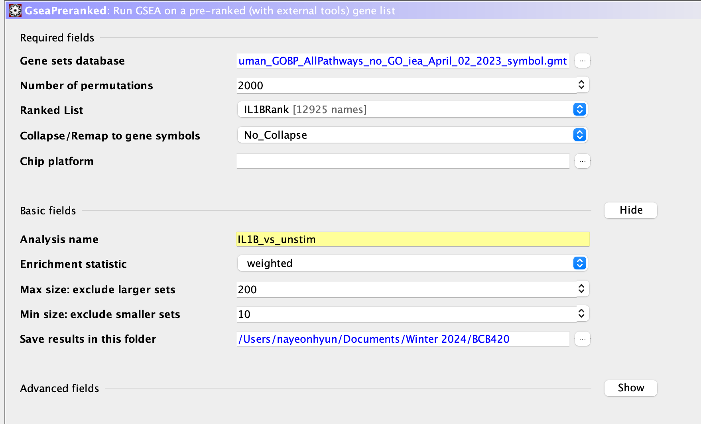
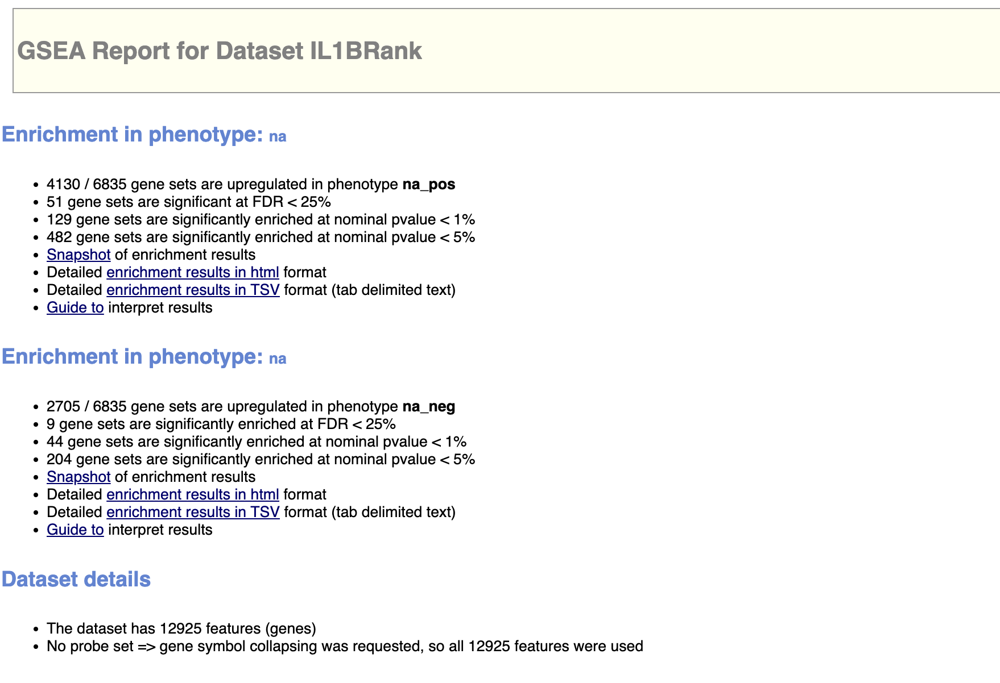
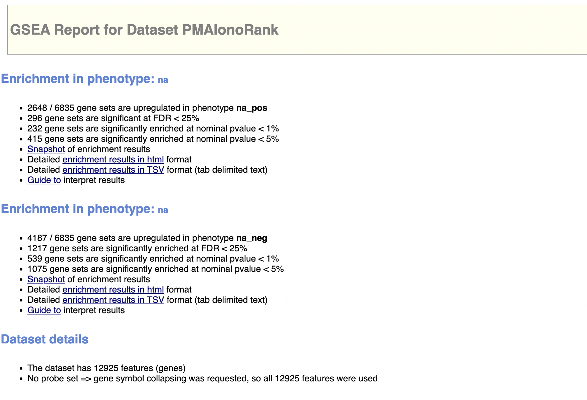
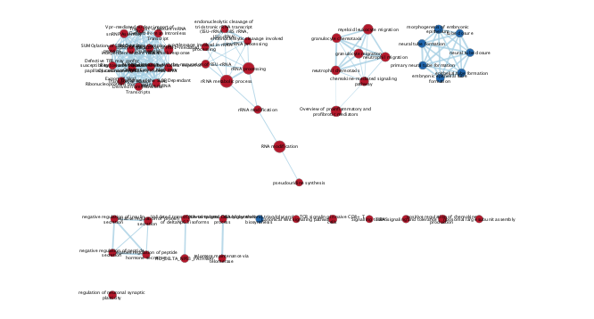
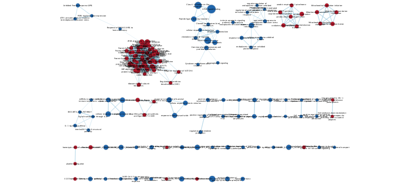
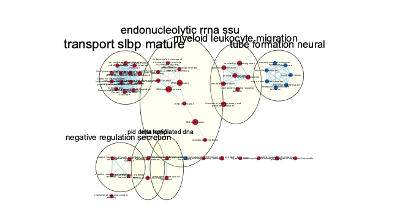
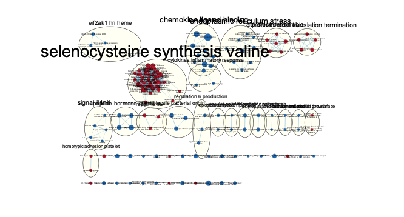

```{r, include=FALSE}
# Install/load packages
if (! requireNamespace("BiocManager", quietly = TRUE)) {
  install.packages("BiocManager")
}

if (! requireNamespace("Biobase", quietly = TRUE)) {
  BiocManager::install("Biobase")
}

if (!requireNamespace("edgeR", quietly = TRUE)) {
  install.packages("edgeR")
}

library(edgeR)

```
## Introduction

For my dataset, I chose the paper, [Human germline biallelic complete NFAT1 deficiency causes the triad of joint contractures, osteochondromas, and susceptibility to B cell malignancy](https://www.ncbi.nlm.nih.gov/geo/query/acc.cgi?acc=GSE193414). This dataset was downloaded from GEO and its accession ID is GSE193414. @sharma2022human

There are 18 bulk RNA-seq samples from three patients. One patient is the first reported case of human complete NFAT1 deficiency. The other two are his parents who had a consanguineous relationship. Half of the 18 samples (labelled as "patient") are infected with an empty vector, thus is the negative control. The other 9 samples are infected with WT-NFATC2 which is the test condition. @sharma2022human

Each replicate's patient and rescue samples were treated with PMAIonomycin and IL-1b. Thus there are 3 treatment groups, one untreated, PMAIono, and IL1b for each replicate's patient and rescue samples. @sharma2022human

In Assignment 2, I performed thresholded gene analysis to see whether adding PMAIonomycin and IL-1b caused some genes to be differentially expressed. 

I will first load the differential expression tables obtained from Assignment 2.

```{r}
# IL1B differential expression table
path <- file.path(getwd(), "qlfIL1BHits.rds")
IL1BDiffExpression <- readRDS(path)
head(IL1BDiffExpression)

# PMAIono differential expression table
path <- file.path(getwd(), "qlfPMAIonoHits.rds")
PMAIonoDiffExpression <- readRDS(path)
head(PMAIonoDiffExpression)
```
## Non-thresholded Gene set Enrichment Analysis

To start our GSEA analysis, we will first create the rank file. @subramanian2005gene

```{r}
# IL1B rank file
IL1BRank <- data.frame(Gene = row.names(IL1BDiffExpression))
IL1BRank$Rank <- sign(IL1BDiffExpression$logFC) * -log(IL1BDiffExpression$PValue, base=10) 
IL1BRank <- IL1BRank[order(IL1BRank$Rank, decreasing = TRUE),]

head(IL1BRank)

# PMAIono rank file
PMAIonoRank <- data.frame(Gene = row.names(PMAIonoDiffExpression))
PMAIonoRank$Rank <- sign(PMAIonoDiffExpression$logFC) * -log(PMAIonoDiffExpression$PValue, base=10) 
PMAIonoRank <- PMAIonoRank[order(PMAIonoRank$Rank, decreasing = TRUE),]

head(PMAIonoRank)
```
These rank files will be used in GSEA so we need to save it into a `.rnk` file.  @subramanian2005gene
```{r}
write.table(IL1BRank, file='IL1BRank.rnk', quote=FALSE, sep='\t', row.names = FALSE)
write.table(PMAIonoRank, file='PMAIonoRank.rnk', quote=FALSE, sep='\t', row.names = FALSE)
```

These were the parameters used for GSEA runs. Note the GSEA analysis was done using GSEAPrerank. The gmt file used was `Human_GOBP_AllPathways_no_GO_iea_April_02_2023_symbol.gmt`. @subramanian2005gene

The results of the analysis from GSEA are shown below.



These results show that for IL1B around 4000 genes were upregulated and around 2500 genes were upregulated in PMAIono. Compared to the thresholded analysis in Assignment 2, the results are similar in the PMAIono sample but not in IL1B as the A2 results were around 2300 upregulated genes. Thresholded over-representation analysis and GSEA is not a straightforward comparison because the input for Thresholded ORA is the significant genes after differential expression analysis meanwhile GSEA's input is all the genes that have been ranked.  @subramanian2005gene


## Enrichment Analysis
Platforms used for network formation: Cytoscape 3.10.2 and EnrichmentMap 3.3.6. @shannon2003cytoscape @isserlin2014enrichment

The parameters for IL1B:

* analysis type: GSEA
* enrichments pos: gsea_report_for_na_pos_1711870096598.tsv
* enrichments neg: gsea_report_for_na_neg_1711870096598.tsv
* gmt: Human_GOBP_AllPathways_no_GO_iea_March_01_2021_symbol.gmt
* ranks: ranked_gene_list_na_pos_versus_na_neg_1711507004463.tsv
* expressions: IL1BRank.rnk
* FDR: 0.2



The parameters for PMAIono:

* analysis type: GSEA
* enrichments pos: gsea_report_for_na_pos_1711873264251.tsv
* enrichments neg: gsea_report_for_na_pos_1711873264251.tsv
* gmt: Human_GOBP_AllPathways_no_GO_iea_March_01_2021_symbol.gmt
* ranks: ranked_gene_list_na_pos_versus_na_neg_1711873264251.tsv
* expressions: PMAIonoRank.rnk
* FDR: 0.01


I then used the AutoAnnotate app to annotate the enrichment maps generated above. @kucera2016autoannotate



The top annotated themes for IL1B are

* transport slbp mature:	14	
* endonucleolytic rrna ssu:	9	
* myeloid leukocyte migration:	7	
* tube formation neural:	7	
* negative regulation secretion:	4	




The top annotated themes for PMAIono are:

* selenocysteine synthesis valine:	54	
* chemokine ligand binding:	9	
* endoplasmic reticulum stress:	9	
* atp electron aerobic:	6	
* mitochondrial translation termination:	5	

## Analysis
These top theme differ between IL1B and PMAIono. But, these results do align with the paper as it stated that naive cells had a higher expression T cell activation markers CXCR3 which is in the chemokine ligand pathway.
Also, endoplasmic reticulum stress is a top theme in PMAIono. This makes sense because in the paper, it explains how intracellular calcium signaling coordinates a wide range of crucial physiological and immunological functions. When the T-cell receptor or B-cell receptor is engaged, calcium ions are released from the endoplasmic reticulum into the cytosol. These free calcium ions then bind to calmodulin, inducing a structural change that facilitates the binding of the serine/threonine phosphatase calcineurin. This interaction between calmodulin and calcineurin triggers the activation of NFAT2 and other transcription factors. @sharma2022human

## References


